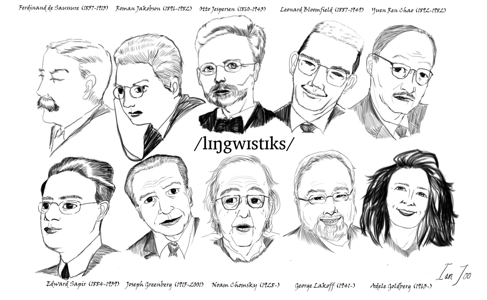

```{r setup, include=FALSE}
knitr::opts_chunk$set(echo = FALSE)
```

The head of a Buddha sculpture embedded in a tree (Ayutthaya, Thailand)

{ width=50% }

The giants of linguistics

{ width=80% }

Buddha, facing the demon challenging his enlightenment

{ width=80% }

A birthday gift for grandma

{ width=50% }

[A Burmese nun pleading the police not to shoot civilians](https://www.ucanews.com/news/a-brave-nun-makes-a-stand-in-myanmar/91607)

{ width=80% }


