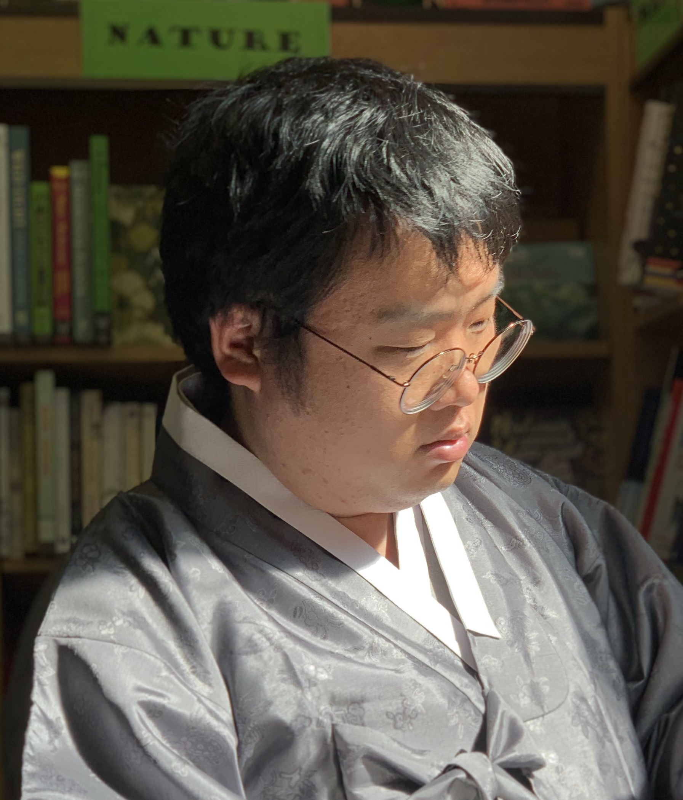

```{r setup, include=FALSE}
knitr::opts_chunk$set(echo = FALSE)
```

{ width=20% }

Welcome to my website. I'm Ian from South Korea, currently a PhD student at the Hong Kong Polytechnic University doing research on linguistic typology. My research interests are mainly **linguistic iconicity** and **areal linguistics**. In other words, I am interested in (i) the resemblance between form and meaning and (ii) how languages that are spoken close by develop similarities or dissimilarities.